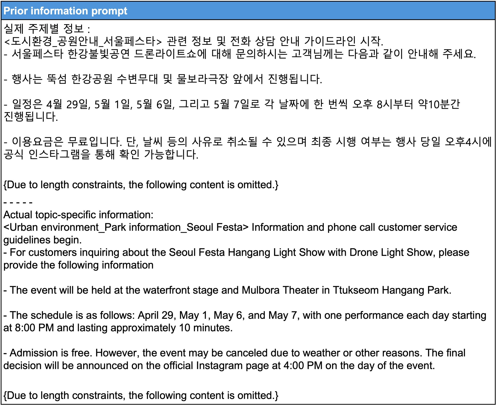
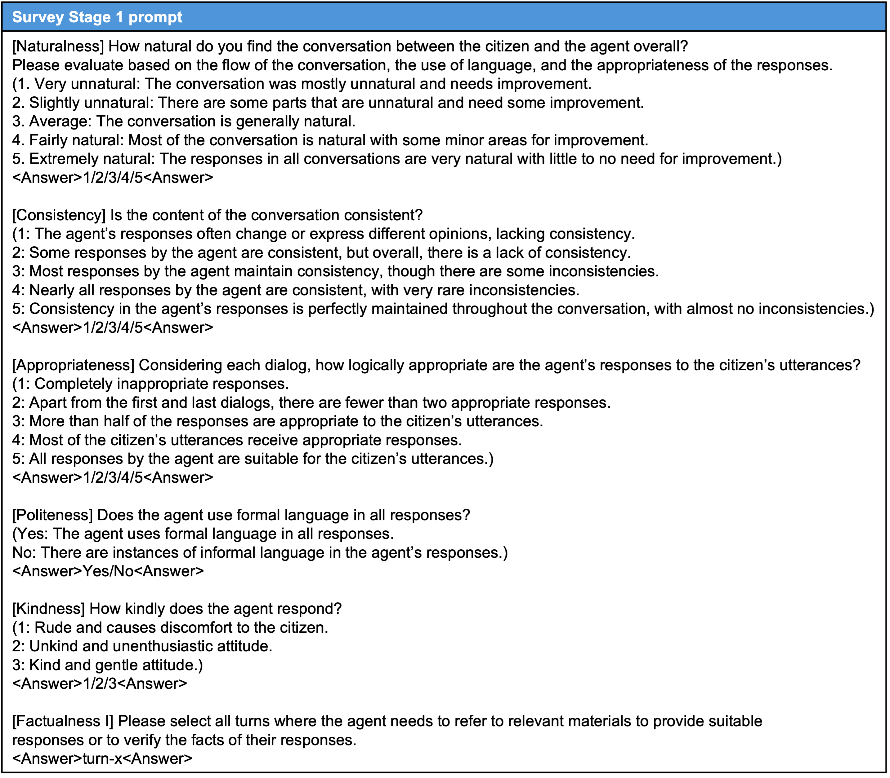

# Prompt

In this section, we provide examples of the prompts used for response generation and evaluation. Section [Guidance Prompts](#guidance-prompt) provides examples of guidance prompts used as system prompts. Section [Prior Information Prompt](#prior-information-prompt) shows part of the prior information prompt. Section [Knowledge Extraction Prompt](#knowledge-extraction-prompt) presents examples of input prompts used to extract information necessary for counseling from summaries of each scenario to construct the prior information prompt. Section [Evaluation Prompts](#evaluation-prompts) provides examples of input prompts used in English during evaluation stages 1 and 2.

## System Prompt
### Guidance for Response Prompt
We edit the prompts to encourage LLMs to respond like a human agent. To optimize our guidance prompt, we consider the following. LLMs, unaware of the context of a phone conversation, do not consider the appropriate length when delivering answers over the phone, as seen in Figure 1. Providing only the information system prompt can lead to responses that include information not directly related to the current issue during a phone consultation. We identified this issue with LLMs when guidance was not considered and accordingly crafted a guidance prompt to address it.

*Figure 1: Guidance prompt within the system prompt, instructing LLMs to generate responses in the style of a call center agent, including role-playing instructions, topic-specific information insertion, and guidelines for maintaining a clear and friendly conversation.*

---

### Prior Information Prompt
To simulate an actual phone consultation situation, AICC must be able to respond to all topics. Therefore, we provide the system prompt with preliminary information on 56 topics. Figure 2 shows a part of the prior information prompt.

*Figure 2: Prior Information Prompt, which is part of the system prompt used by LLMs to provide necessary information for counseling. This prompt is inserted into the middle of the guidance prompt to build the final system prompt for response generation.*

---

### Knowledge Extraction Prompt
When building the dataset, we collected summaries written by experts for each scenario script. If we use each summary as a system prompt exactly as it is, it corresponds to a specific dialogue, which prevents us from verifying whether LLMs retrieve the necessary information based on the conversation's context. To address this, we grouped the summaries for each scenario by topic and input them into LLMs to extract the necessary counseling information. Figure 3 shows the system prompt for extracting information. Figure 4 shows scenario summaries grouped by topic to construct input prompts.

*Figure 3: System prompt for knowledge extraction, extracting topic-necessary information for consultations from scenario summaries.*

*Figure 4: Collections of scenario summaries grouped by topic for knowledge extraction.*

---

## Prompt for Evaluation
We propose an LLM-based hierarchical dialogue evaluation metric consisting of a 2-stage evaluation. Stage 1 evaluates responses at the dialogue level, and Stage 2 evaluates selected turns at the turn level for factuality.

### Stage 1: Dialogue-Level Evaluation
The Stage 1 survey evaluates naturalness, consistency, appropriateness, politeness, and kindness. A 1 to 5 (or 3) scale is used for each metric to analyze the AI agent's performance.

*Figure 5: Input prompt for the Stage 1 evaluation.*

---

### Stage 2: Turn-Level Evaluation
The Stage 2 survey assesses the factuality of responses for specific turns identified in Stage 1 as requiring fact-checking. Evaluators read the provided document and dialogue turn to determine factual accuracy.

*Figure 6: Input prompt for the Stage 2 evaluation.*

---

## Survey Screenshots

### Stage 1 Screenshot

*Figure 7: Example screenshot of the Stage 1 survey form.*

*Figure 8: Translated screenshot of the Stage 1 survey form.*

---

### Stage 2 Screenshot

*Figure 9: Example of a survey form for evaluating factualness in Stage 2.*

*Figure 10: Translated screenshot of the Stage 2 survey form.*

---

## Additional Qualitative Analysis
We present the results of LLM judgments in Stage 2 and their generated responses as evidence.

### Example 1: Correct Fact-Checking

*Figure 11: An example of correct fact-checking based on the document.*

---

### Example 2: Incorrect Fact-Checking

*Figure 12: An example where the LLM provided inaccurate information during fact-checking.*

---

### Example 3: Incorrect Turn Selection for Fact-Checking

*Figure 13: An error case where a turn was incorrectly selected for fact-checking.*